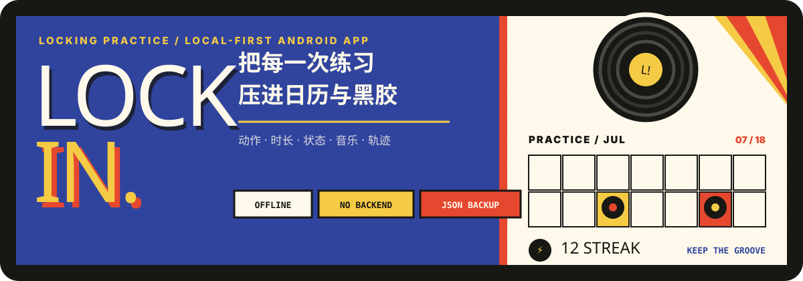
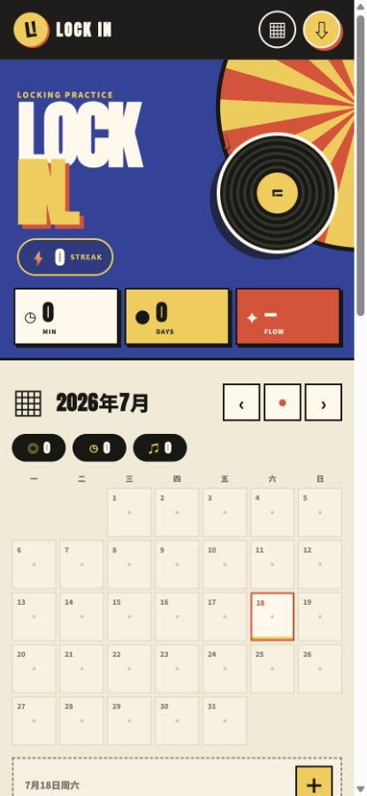
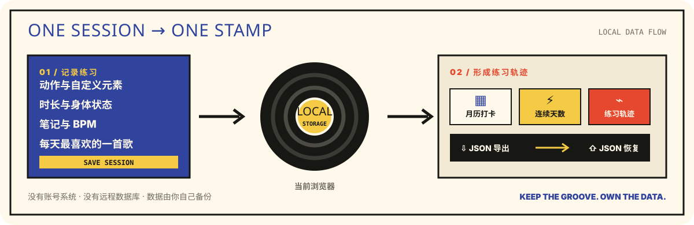

<p align="center">
  
</p>

<p align="center">
  <a href="https://xugcc.github.io/lock-in/"><strong>打开 LOCK IN</strong></a>
  ·
  <a href="#开始使用">开始使用</a>
  ·
  <a href="#数据与隐私">数据与隐私</a>
</p>

`LOCK IN` 是一个为 Locking 练习设计的本地优先 PWA。它把动作、时长、身体状态、笔记和每天最喜欢的一首歌，整理成可以持续回看的日历打卡与练习轨迹。

<p align="center">
  
</p>

## 不只是计时，更是留下练习的节奏

- 用月历查看练习次数、分钟数、连续天数和当天记录。
- 记录 Lock、Point、Wrist Roll、Scooby Doo、Stop & Go、Groove、Freestyle，或添加自己的练习元素。
- 为每次练习保存时长、身体状态、笔记和 BPM。
- 每天保留唯一一首“今日最爱”，可从网易云音乐分享链接识别歌曲信息。
- 编辑、筛选或删除历史记录，并通过 JSON 导入和导出备份。
- 所有应用资源都随仓库提供，首次加载后可离线继续使用。

## 一次练习，如何变成一枚日历唱片

<p align="center">
  
</p>

应用没有后端和账号系统。练习记录、自定义元素与每日歌曲信息都保存在当前浏览器的 `localStorage` 中；日历、统计和练习轨迹由这些本地数据即时生成。

## 开始使用

1. 在手机浏览器打开 [LOCK IN](https://xugcc.github.io/lock-in/)。
2. 点击右上角的下载按钮，或从浏览器菜单选择“安装应用 / 添加到主屏幕”。
3. 选择日期、动作、状态和时长，保存你的第一次练习。

小米浏览器通常可以从菜单中选择“添加到桌面”或“添加到主屏幕”。Chrome 会在满足安装条件时提供“安装应用”。

## 数据与隐私

- 练习记录只保存在当前浏览器，不会上传到本仓库或同步到其他设备。
- 应用不会读取网易云账号、歌单或听歌历史。
- 自动识别歌曲时，歌曲 ID 会发送到公开的 Meting 解析服务；网易云短链接会先通过 Unshorten.me 取得最终歌曲地址。
- 外部识别服务不可用时，仍可手动填写歌名、歌手和 BPM，并使用本地默认封面。
- 清除浏览器数据、换浏览器或换设备后，记录不会自动保留。请定期使用页面底部的 `⇩ JSON` 导出备份，再通过 `⇧ JSON` 恢复。

## 自托管到 GitHub Pages

这是一个不需要构建步骤的静态项目。Fork 或复制仓库后：

1. 打开仓库的 **Settings → Pages**。
2. 在 **Build and deployment** 中选择 **Deploy from a branch**。
3. 选择 `main` 分支和 `/ (root)`，保存后等待 Pages 发布。

首次在线访问会由 Service Worker 缓存页面、字体、图标、GSAP 和默认唱片封面。之后即使断网，也可以继续打开和记录练习。

## 项目结构

```text
lock-in/
├── index.html                 # 应用结构与可访问性标签
├── styles.css                 # 移动端视觉系统与响应式布局
├── app.js                     # 记录、统计、歌曲识别与交互逻辑
├── sw.js                      # 离线缓存
├── manifest.webmanifest       # PWA 安装信息
├── fonts/                     # 本地 Anton 展示字体与许可证
├── vendor/                    # 本地 GSAP 与 ScrollTrigger
└── assets/readme/             # README 视觉素材与真实界面截图
```

项目使用原生 HTML、CSS 和 JavaScript，无需数据库、运行时或包管理器。
